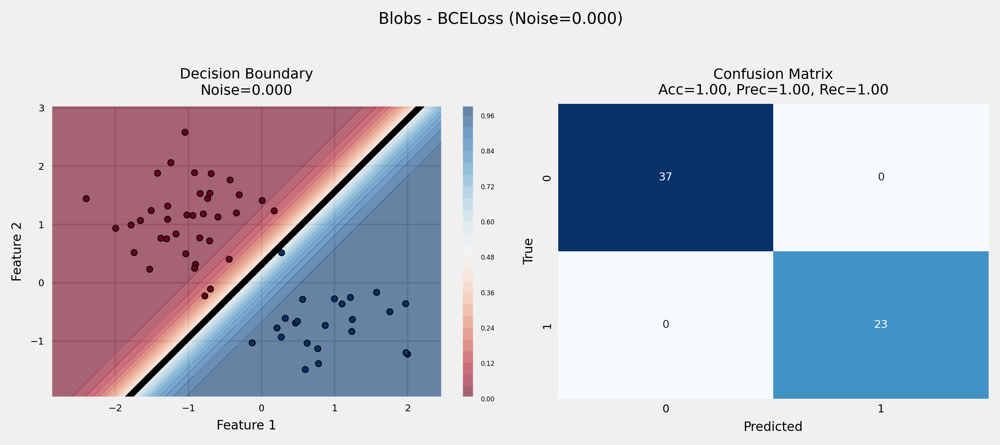
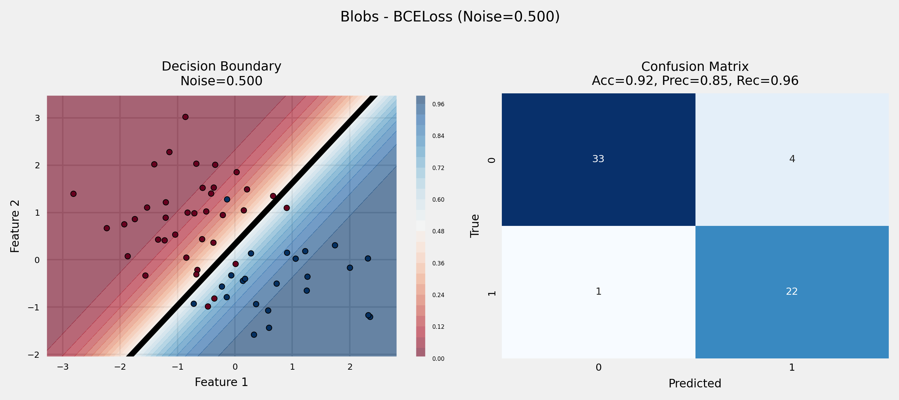
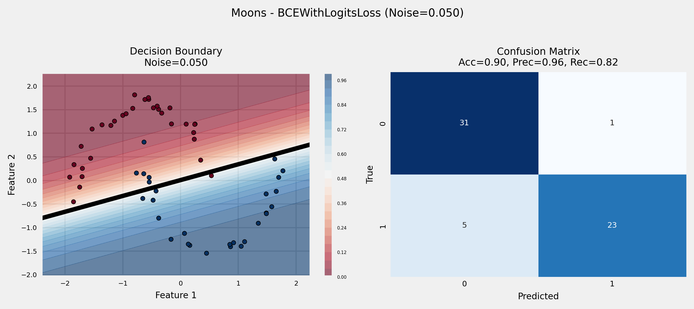
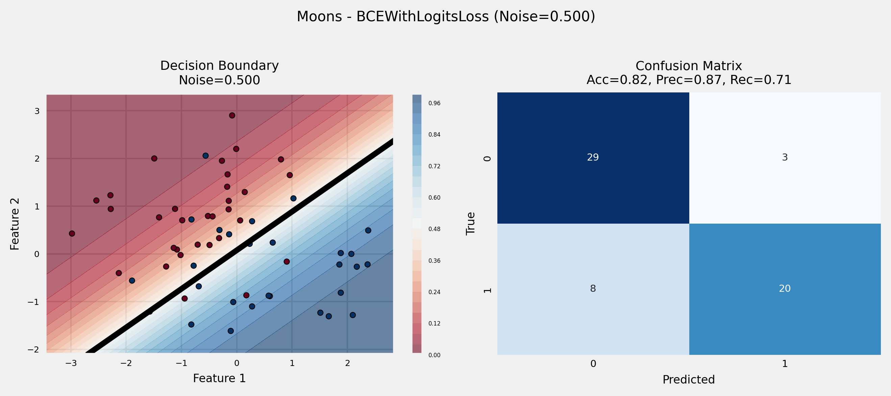

# Linear Classification with Logistic Regression challenge

This project implements a **linear binary classifier** using logistic regression with PyTorch.  
My goal is to explore the effect of **different noise levels** on three synthetic datasets (Moons, Circles, Blobs) and compare **two binary cross-entropy loss functions**:

- `nn.BCELoss` — expects probabilities as input  
- `nn.BCEWithLogitsLoss` — expects logits, more numerically stable  

We analyze how noise affects the **decision boundary, training loss, and classification metrics** for a simple linear model.

---

## Instructions

**Install dependencies**  

Make sure you have Python 3.x and run:

```bash
pip install -r requirements.txt
```

Next, run the python notebook with your preferred runner.

## Results

In this experiment, we have verified how well a linear model can classify different datasets. We have observed that:

- For poorly separable datasets, boundaries barely shift as noise increases because logistic regression finds the line that best separates the average class positions.
- For well-separable datasets, the boundary starts accurate but gradually worsens with noise.
- Training loss behaves similarly across BCE variants due to the linear model limitation, but we have not encountered an extreme case for BCELoss behaving badly, though it's still possible it could.

Here's an example of a well-separable dataset:


Here's the same dataset but with more noise:


And a set that is not well-separable:


Same set with more noise:


Video link explaining the experiment [here](https://www.loom.com/share/ff81b93189144b8fb041c4adf6b0b3b5?sid=376d6723-491c-4648-a7bc-26b17f7bc72d)